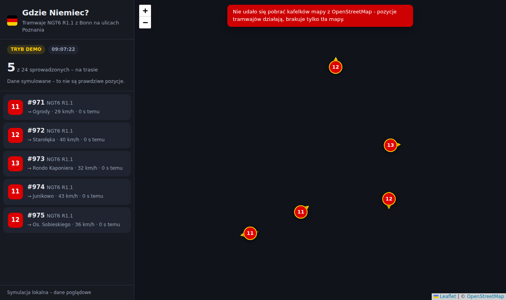

# Gdzie Niemiec?

Mapa na żywo tramwajów **Duewag/Siemens NGT6D „R1.1”** — wagonów sprowadzonych
przez MPK Poznań z Bonn — kursujących po Poznaniu.

Aplikacja pobiera pozycje pojazdów z feedu **GTFS-RT ZTM Poznań**, wybiera z nich
wyłącznie wagony z Bonn i pokazuje je na mapie: linia, kierunek, prędkość, wiek
pozycji i ślad ostatniego przejazdu.



## Uruchomienie

```bash
npm install
npm start            # dane na żywo z ZTM Poznań  -> http://localhost:3000
npm run demo         # symulacja (działa bez dostępu do ZTM)
npm test             # testy jednostkowe
```

Aplikacja nie wymaga żadnego klucza API — dane ZTM Poznań są otwarte.
Leaflet jest serwowany lokalnie z `node_modules`, więc jedyne, czego frontend
potrzebuje z internetu, to kafelki mapy z OpenStreetMap.

## Jak rozpoznawane są „Niemcy”

Feed GTFS-RT podaje tylko identyfikator pojazdu, bez modelu, więc tramwaje z Bonn
wybierane są dwutorowo:

1. **Słownik pojazdów ZTM** (`vehicle_dictionary.csv`) — źródło główne. Aplikacja
   szuka w nim wierszy pasujących do wzorca modelu (`R1.1`, `NGT6`) i bierze z nich
   numery taborowe. Nazwy kolumn nie są zaszyte na sztywno, więc zmiana formatu
   pliku po stronie ZTM nie psuje rozpoznawania.
2. **Lista numerów z konfiguracji** — używana, gdy słownik jest niedostępny albo
   nie zawiera modelu. Domyślnie `971-994`: MPK Poznań kupiło 24 wagony, a pierwszy
   z nich wyjechał na linię jako **971**. Jeśli faktyczna numeracja okaże się inna,
   popraw ją bez ruszania kodu — przez `BONN_FLEET` w pliku `.env`.

Numer dopasowywany jest tolerancyjnie: `971`, `0971` i `T_971` to ten sam wagon,
ale `9710` już nie.

## Tryb demo

`npm run demo` uruchamia symulację: kilka wagonów jeździ tam i z powrotem po
uproszczonych korytarzach poznańskiej sieci (trasy przez Kaponierę, PST, Rataje,
Górczyn). Przydaje się w nocy, gdy nic nie jeździ, oraz w sieciach, które blokują
dostęp do `ztm.poznan.pl`.

Ten sam mechanizm działa awaryjnie: jeśli feed ZTM przestanie odpowiadać,
aplikacja zamiast pustej mapy pokaże symulację i wyraźnie ją oznaczy
(`DEMO_FALLBACK=0` wyłącza to zachowanie).

## Wdrożenie do sieci

Aplikacja jest serwerem Node (to backend odpytuje ZTM i filtruje tabor), więc
potrzebuje hostingu uruchamiającego proces — sam hosting plików statycznych nie
wystarczy. W repo są gotowe konfiguracje dla trzech typowych dróg.

### Fly.io (polecane — region Warszawa)

```bash
fly launch --copy-config --name gdzie-niemiec-twoja-nazwa
fly deploy
fly open
```

`fly.toml` ustawia region `waw`, HTTPS, healthcheck na `/api/health` i usypianie
maszyny przy braku ruchu (`auto_stop_machines`), więc mały ruch mieści się
w darmowym limicie. Kosztem jest ~1 s zimnego startu po dłuższej przerwie.

### Render (bez CLI, przez przeglądarkę)

W panelu Render: **New → Blueprint** i wskaż to repozytorium — `render.yaml`
zawiera resztę. Każdy push na gałąź wdraża się sam. Na darmowym planie serwis
zasypia po 15 minutach bezczynności.

### Własny serwer / VPS

```bash
docker build -t gdzie-niemiec .
docker run -d --restart=unless-stopped -p 8080:8080 --name gdzie-niemiec gdzie-niemiec
```

Przed kontenerem postaw reverse proxy z certyfikatem (Caddy, nginx, Traefik).
Obraz startuje jako użytkownik `node`, nie jako root.

### O czym pamiętać na produkcji

- **`DEMO_FALLBACK=0`** — ustawione we wszystkich powyższych konfiguracjach.
  Na publicznej stronie awaria feedu ZTM ma dać pustą mapę i komunikat o błędzie,
  a nie symulowane tramwaje, których nikt nie odróżni od prawdziwych.
- **Jedna instancja wystarczy.** Cache feedu żyje w pamięci procesu, więc jedna
  maszyna oznacza najwyżej jedno zapytanie do ZTM na 8 sekund niezależnie od
  liczby odwiedzających. Skalowanie w poziom zwielokrotniłoby ruch do ZTM.
- Serwer słucha na `0.0.0.0` i bierze port ze zmiennej `PORT`, więc działa też na
  hostingach, które narzucają port (Heroku, Railway, App Runner).
- `/api/health` nadaje się na healthcheck i monitoring zewnętrzny (np. UptimeRobot).

## API

| Endpoint | Opis |
| --- | --- |
| `GET /api/vehicles` | Tramwaje z Bonn aktualnie na trasie + metadane (tryb, źródło listy taboru, liczba wszystkich pojazdów w sieci) |
| `GET /api/health` | Stan aplikacji i ostatni błąd pobierania feedu |

```jsonc
{
  "mode": "live",
  "updatedAt": "2026-09-11T09:07:22.481Z",
  "totalVehicles": 412,
  "fleet": { "source": "słownik pojazdów ZTM", "size": 24, "total": 24 },
  "vehicles": [
    {
      "id": "971", "routeId": "11", "lat": 52.4083, "lon": 16.9147,
      "bearing": 45, "speedKmh": 29, "ageSec": 6, "trail": [[52.4081, 16.9139]]
    }
  ]
}
```

Feed ZTM odświeża się mniej więcej co 10 sekund; serwer cache'uje odpowiedzi
(`FEED_CACHE_MS`), więc wielu otwartych przeglądarek nie przekłada się na
wiele zapytań do ZTM.

## Konfiguracja

Wszystkie ustawienia to zmienne środowiskowe — pełna lista z opisami znajduje się
w `.env.example`, a wartości domyślne w `src/config.js`.

## Struktura

```
src/config.js    konfiguracja i parsowanie zakresów numerów taborowych
src/ztm.js       pobieranie i dekodowanie GTFS-RT (protobuf)
src/fleet.js     parser słownika pojazdów i dopasowywanie numerów
src/demo.js      symulator tramwajów (tryb demo i awaryjny)
src/tracker.js   cache, filtrowanie, ślady tras
src/server.js    serwer HTTP i API
public/          mapa (Leaflet), lista pojazdów, panel statusu
test/            testy jednostkowe (node:test)
```

## Źródła danych

- [ZTM Poznań — GTFS-RT](https://www.ztm.poznan.pl/otwarte-dane/gtfs-rt/) (pozycje pojazdów, słownik taboru)
- [MPK Poznań — NGT6 R1.1](https://www.mpk.poznan.pl/tabor/ngt6-r1-1/) (dane techniczne wagonów z Bonn)
- Kafelki mapy: [OpenStreetMap](https://www.openstreetmap.org/copyright)
